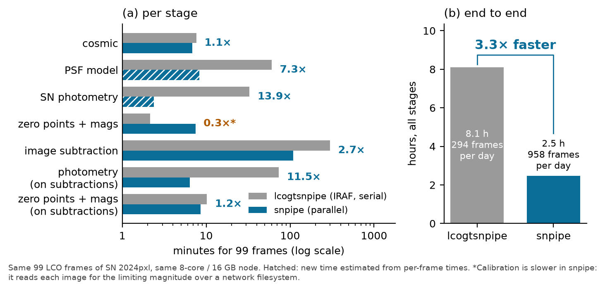
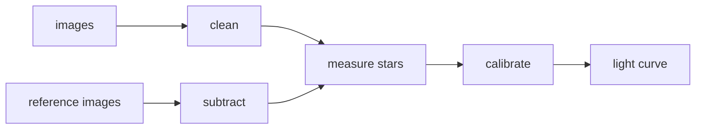

# snpipe — the LCOGT supernova pipeline, without IRAF

snpipe turns LCO images of a supernova into a calibrated light curve, the same way
[lcogtsnpipe](https://github.com/LCOGT/lcogtsnpipe) does — in pure Python, faster, and with checks an AI agent can read.

*SN 2024pxl: the published light curve (grey), the original pipeline (open circles) and snpipe (filled squares) agree.*

## Why a new pipeline?

lcogtsnpipe is well tested, but it depends on IRAF (no longer supported by NOAO and hard to install), needs a MySQL
server, processes images one at a time, and needs a person at the screen to check each step. That makes it slow,
hard to set up, and hard to hand to an AI agent. snpipe keeps the science and removes those obstacles.

*Same 99 frames, same computer: 8.1 h → 2.5 h. Vector version: [speed.pdf](docs/report/visual/speed.pdf).*

## What you get

- **Same results** as the original pipeline, checked step by step on real data.
- **No IRAF**: installs with `pip`.
- **Faster**: steps run in parallel.
- **Agent-ready**: every step reports ok / warn / fail and shows pictures of anything doubtful.

## Details

- [Report: old vs new, with pictures](docs/report/README.md)
- [How to install and run](docs/usage.md)
- [How an agent runs and checks it](docs/agents.md)
- [Where it differs from the old code](docs/decisions.md)

## Credits

Built by **Claude (Anthropic, Claude Opus 5.5) in Claude Code**, directed and reviewed by Yize Dong.
Based on lcogtsnpipe (S. Valenti et al.), PyZOGY (D. Guevel) and SLIDE (Y. Dong). MIT licence.
