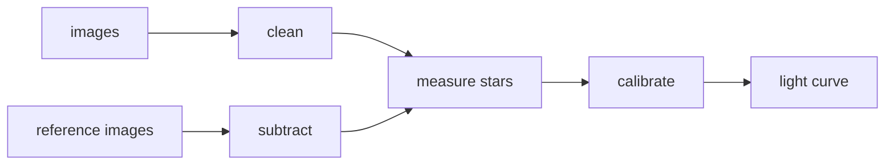

# snpipe — the LCOGT supernova pipeline, without IRAF

snpipe turns LCO images of a supernova into a calibrated light curve, the same way
[lcogtsnpipe](https://github.com/LCOGT/lcogtsnpipe) does — in pure Python, faster, and with checks an AI agent can read.

*SN 2024pxl: the published light curve (grey), the original pipeline (open circles) and snpipe (filled squares) agree.*

- **Same results** as the original pipeline, checked step by step on real data.
- **No IRAF**: installs with `pip`.
- **Faster**: steps run in parallel.
- **Agent-ready**: every step reports ok / warn / fail and shows pictures of anything doubtful.

## Details

- [Report: old vs new, with pictures](docs/report/README.md)
- [How to install and run](docs/usage.md)
- [How an agent runs and checks it](docs/agents.md)
- [Where it differs from the old code](docs/decisions.md)

## Credits

Built by **Claude (Anthropic, Claude Opus 5.5) in Claude Code**, directed and reviewed by Yize Dong.
Based on lcogtsnpipe (S. Valenti et al.), PyZOGY (D. Guevel) and SLIDE (Y. Dong). MIT licence.
