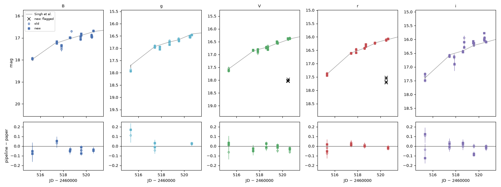
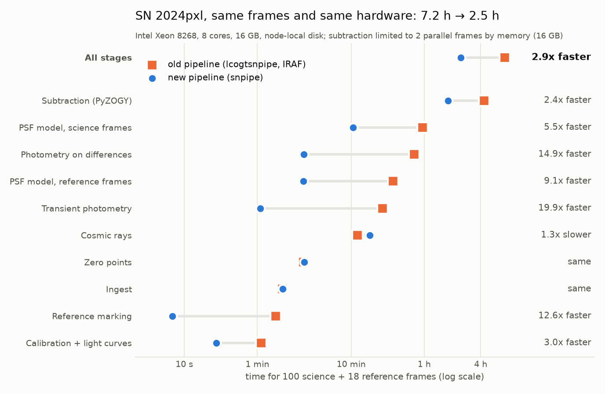

# lcogtsnpipe-ai

Light curves of transients from Las Cumbres Observatory images: the science of
[lcogtsnpipe](https://github.com/LCOGT/lcogtsnpipe), without IRAF or MySQL, with every step checked and every choice
written down. Part of **Transient SLOP** (Single-object Legacy Observation Products).



*SN 2024pxl: published light curve (grey), original pipeline (open circles), this pipeline (filled).
[Validation](docs/validation/sn2024pxl/README.md).*



*Same 100 science + 18 reference frames, same node type (8 cores, 16 GB), run one after the other: 7.2 h → 2.5 h
(2.9×). Measured, not estimated; data staging excluded. [Benchmark](docs/validation/sn2024pxl/benchmark/README.md).*

## Quickstart

```bash
pip install "lcogtsnpipe-ai[astra] @ git+https://github.com/yizedong/lcogtsnpipe-ai"

# a folder of BANZAI frames (*-e91.fits.fz) with the archive's frames.json, or --frames archive (LCO_API_KEY)
snpipe init-target ~/reductions/sn2025xyz --name 2025xyz --alias SN2025xyz --ra 123.456789 --dec -12.345678 \
    --science 20250801-20251231 --reference 20260905 --camera fa --frames /data/raw/2025xyz
snpipe run ~/reductions/sn2025xyz          # every step, checked; resumes if interrupted
```

The result is `results/baseline/` in the target's working directory: the light curves (with and without
subtraction of a reference image), a report with every step's checks, and a review queue with a picture for every
doubtful frame. Bands: B V g r i (U needs standard-star nights and is not supported yet).

## How it is organised

```
pipeline/astra.yaml        the recipe: every step and every methodological choice, with its reason (ASTRA format)
targets/<name>/            example objects: target.yaml (facts) + universes/ (choices)
src/snpipe/                the code: one module per stage
docs/                      guide, reference, validation
tests/  tools/             tests; scripts that build the docs pages
```

The recipe is an [ASTRA](https://github.com/LightconeResearch/astra-spec) analysis, so the full reduction, with
every decision and its options, is a document that people and agents can read, check (`astra validate`) and vary
(universes), while `snpipe run` executes it.

## Documentation

| | |
|---|---|
| **Use it** | [install](docs/guide/install.md) · [targets](docs/guide/targets.md) · [running](docs/guide/running.md) · [outputs](docs/guide/outputs.md) · [checks](docs/guide/checks.md) · [review](docs/guide/review.md) |
| **Hand it to an agent** | [runbook](docs/guide/agents.md) |
| **Look things up** | [the recipe](docs/reference/recipe.md) · [commands](docs/reference/cli.md) · [differences from lcogtsnpipe](docs/reference/compatibility.md) · [bugs fixed and open](docs/reference/bugs.md) |
| **Trust it** | [SN 2024pxl: old vs new, stage by stage](docs/validation/sn2024pxl/README.md) |

## Contributing

Anyone can open an issue; maintainers approve; an AI agent implements through pull requests; maintainers review.
See [CONTRIBUTING.md](CONTRIBUTING.md).

## Credits

Built by Claude (Anthropic, Claude Opus 5.5) in Claude Code, directed and reviewed by Yize Dong. Based on
lcogtsnpipe (S. Valenti et al.), PyZOGY (D. Guevel) and SLIDE (Y. Dong). MIT licence.
