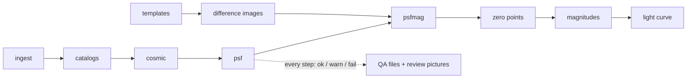

# snpipe — the LCOGT supernova pipeline, without IRAF

**snpipe turns LCO images of a supernova into a calibrated light curve — the same way
[lcogtsnpipe](https://github.com/LCOGT/lcogtsnpipe) does, but in pure Python, faster, and with checks an AI agent can read.**


*SN 2024pxl, five bands. Grey: published light curve (Singh et al. 2026). Open circles: the original pipeline.
Filled squares: snpipe. Crosses: points snpipe flagged as suspicious. Bottom: difference from the paper.*

## In one minute

| | |
|---|---|
| **Same results** | On the same 99 frames, snpipe's light curve differs from the original pipeline's by **0.002 ± 0.03 mag** — about the size of the error bars. Both match the published light curve equally well. |
| **No IRAF** | `pip install` and it runs. No IRAF, no MySQL server, no Docker. |
| **Faster** | **2.7–11×** less time on the photometry and subtraction steps (frames run in parallel; see [timing](docs/report/visual/timing.png)). Disk-bound steps are not faster. |
| **Agent-ready** | Every step says *ok / warn / fail* in a small JSON file, retries failed steps with the manual's fixes, and draws a picture of anything that needs a second look. |

## Try it

```bash
pip install git+https://github.com/yizedong/lcogtsnpipe-ai
export SNPIPE_DIR=$PWD/work
snpipe add-target 2024pxl --ra 263.113958 --dec 7.062411
snpipe ingest --target SN2024pxl --start 2024-07-22 --end 2024-08-01   # downloads from the LCO archive
```

then follow the [recipe](docs/usage.md#full-recipe-difference-imaging-light-curve-as-singh-et-al-2026-for-sn-2024pxl).

## How it works



Each box is one command (`snpipe psf …`), written to reproduce the matching step of the old pipeline number by
number. After each step, an agent reads the step's QA file, and looks at review pictures when something is flagged.

## Learn more

| if you want to … | read |
|---|---|
| see the full old-vs-new comparison, with pictures | [report](docs/report/README.md) (website: `docs/index.html`) |
| run every stage | [usage](docs/usage.md) |
| let an agent run and check a reduction | [agents](docs/agents.md) · [ASTRA record](examples/sn2024pxl/astra.yaml) |
| know exactly where snpipe differs from the old code | [decisions](docs/decisions.md) |

## Credits

This pipeline, the IRAF/DAOPHOT source analysis it is based on, the old-pipeline installation, the validation runs
and the report were produced by **Claude (Anthropic, model Claude Opus 5.5) working in Claude Code**, directed and
reviewed by Yize Dong. It builds on lcogtsnpipe (S. Valenti and contributors, MIT), PyZOGY (D. Guevel, MIT,
bundled in `src/snpipe/_pyzogy`) and the SLIDE package's PyZOGY speed-up idea (Y. Dong, MIT).
