# Stage by stage: old vs new, and how an agent checks it

SN 2024pxl. Both pipelines reduced the same 99 frames of 2024-07-22…28; snpipe also reduced the whole season. Figures: `tools/stage_report.py`. Web version: [docs/stages.html](../stages.html).

**Check loop** (replaces a person at `checkpsf`, `checkdiff`, `getmag --show`…): run stage → gates on every frame → ok: continue · warn: review packet → agent verdict · fail: fix-up ladder → re-check → still failing: review. Each frame gets `<frame>.<stage>.qa.json`; verdicts go to `review/verdicts.jsonl` ([agents.md](../agents.md)).

[Cosmic rays](#cosmic-rays) · [Astrometry (WCS)](#astrometry-wcs) · [PSF model](#psf-model) · [SN photometry](#sn-photometry) · [Zero points](#zero-points) · [Image subtraction](#image-subtraction) · [Calibrated magnitudes](#calibrated-magnitudes) · [Light curve](#light-curve)

## Cosmic rays

Find and mask cosmic-ray hits in every image.

| | |
|---|---|
| **old** | astroscrappy |
| **new** | the same astroscrappy call |

> **bit-identical** masks: 0 pixels differ in the frame shown; 18/18 frames identical

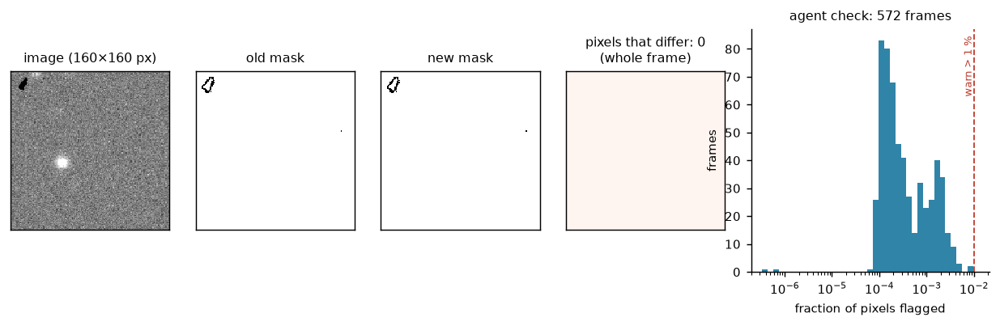

*Left: old vs new. Right: what the agent checks on every frame (dashed red = gate).*

**How the agent checks it**

| check | limit | if it fails |
|---|---|---|
| fraction of pixels flagged | ≤ 1 % | warn → review packet (likely a bad frame, e.g. trails or saturation) |

## Astrometry (WCS)

Check where each image points on the sky.

| | |
|---|---|
| **old** | trusts the BANZAI WCS; a person runs `checkwcs` |
| **new** | measures every frame against Gaia DR3, refits if bad |

> new check (none before); median rms 0.21″ on the 18 templates checked

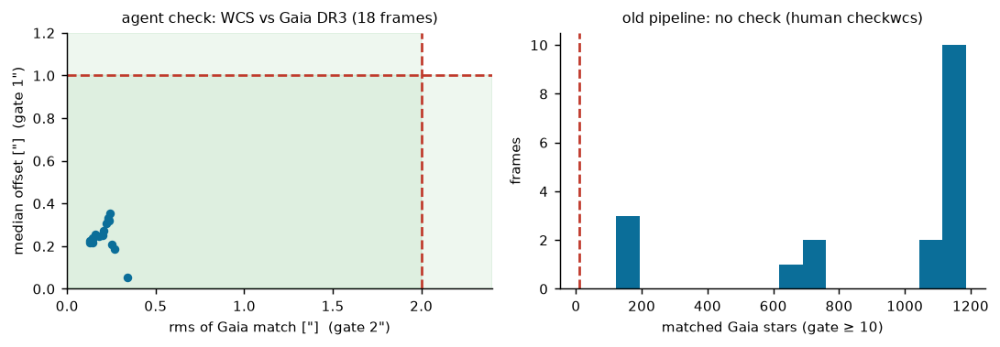

*Left: old vs new. Right: what the agent checks on every frame (dashed red = gate).*

**How the agent checks it**

| check | limit | if it fails |
|---|---|---|
| matched Gaia stars | ≥ 10 | refit; fail if still too few |
| rms of the match | ≤ 2″ | refit, then fail |
| median offset | ≤ 1″ | refit, then fail |

## PSF model

Measure the shape of stars (the PSF) and the aperture correction.

| | |
|---|---|
| **old** | IRAF daophot `phot`, `psf`, `group`, `nstar` |
| **new** | photutils with the same DAOPHOT recipe (Gaussian + look-up table, grouping, fitted sky) |

> aperture correction +0.004 ± 0.009 mag (n=78); aperture photometry identical to IRAF (0.000)

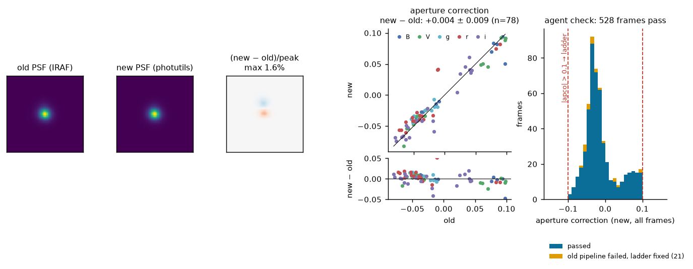

*Left: old vs new. Right: what the agent checks on every frame (dashed red = gate).*

**How the agent checks it**

| check | limit | if it fails |
|---|---|---|
| |aperture correction| | ≤ 0.1 mag (old limit) | remediation ladder → recheck → review if still failing |
| PSF FWHM vs other frames of the night | ensemble outlier | review packet |

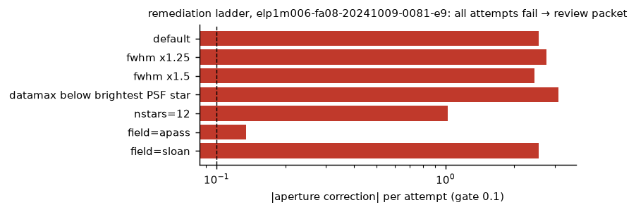

*When the gate fails, the agent reruns the PSF with the fixes listed in the manual (larger FWHM, lower saturation level, more stars, another catalog) and checks again. This frame (7″ seeing) failed every attempt, so it goes to review instead of into the light curve.*

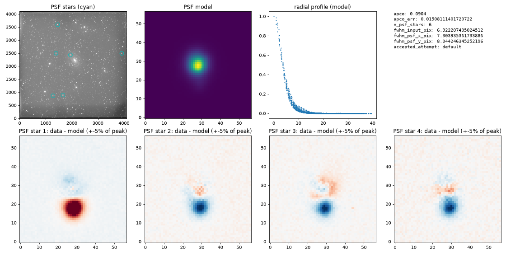

*Review packet: PSF star 1 has a companion 10 px south that leaves a ghost in the model. The old pipeline builds the same PSF; here it is visible to a reviewer.*

## SN photometry

Fit the PSF to the supernova and measure its brightness.

| | |
|---|---|
| **old** | lscsn + daophot `allstar` |
| **new** | photutils PSF fit, IRAF-style sky and background |

> SN PSF magnitude +0.010 ± 0.035 mag (n=78)

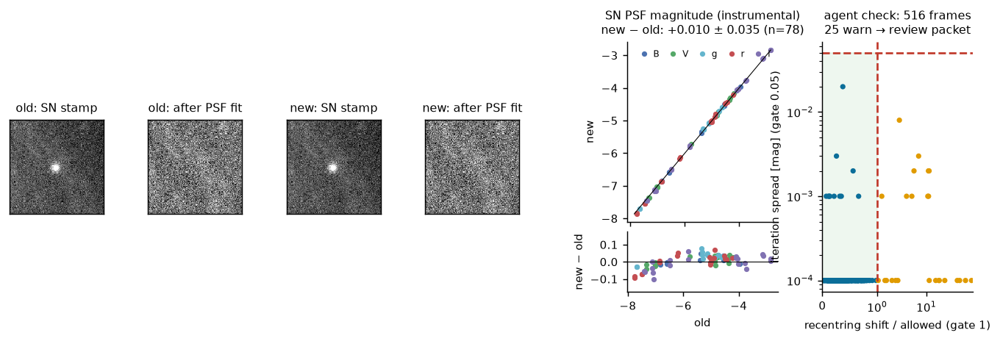

*Left: old vs new. Right: what the agent checks on every frame (dashed red = gate).*

**How the agent checks it**

| check | limit | if it fails |
|---|---|---|
| how far the fit moved from the SN position | ≤ max(2 px, FWHM/2) | warn → review packet |
| spread between fit iterations | ≤ 0.05 mag | warn → review packet |

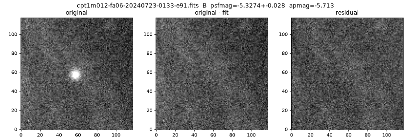

*Review packet: SN stamp, fit and residual.*

## Zero points

Compare field stars with a catalog to get the zero point and colour term.

| | |
|---|---|
| **old** | Python (zcat) |
| **new** | the same code, ported line by line |

> zero point +0.000 ± 0.011 mag (n=41)

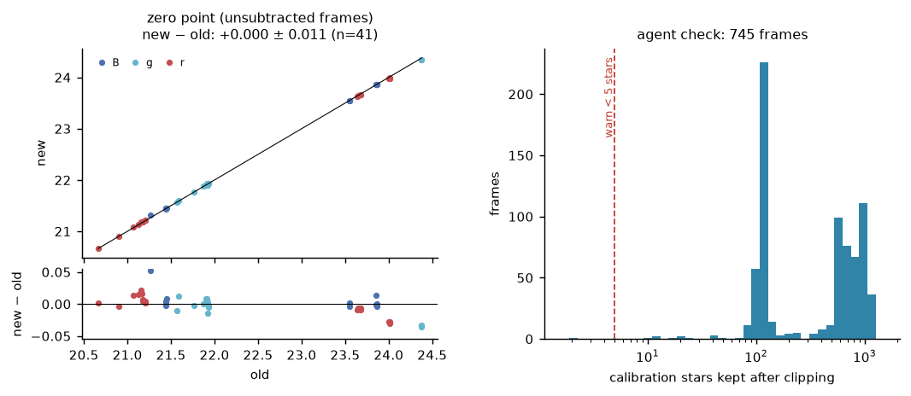

*Left: old vs new. Right: what the agent checks on every frame (dashed red = gate).*

**How the agent checks it**

| check | limit | if it fails |
|---|---|---|
| calibration stars kept after clipping | ≥ 5 | warn → review; frame not calibrated if none |

## Image subtraction

Subtract a pre-explosion template so only the supernova is left.

| | |
|---|---|
| **old** | IRAF geomap + gregister, then PyZOGY |
| **new** | flux-conserving reprojection, then the same PyZOGY (bad-pixel fill 60× faster) |

> SN aperture mag on differences +0.005 ± 0.027 mag (n=92). The noise check finds 19 of 175 new differences failed (PyZOGY's flux-scale fit); of the 8 such frames in the subset, the old pipeline also has no magnitude for 7. Failed frames are dropped from the light curve; the zero-point flux scale (`--gain zeropoint`) is being tested on them.

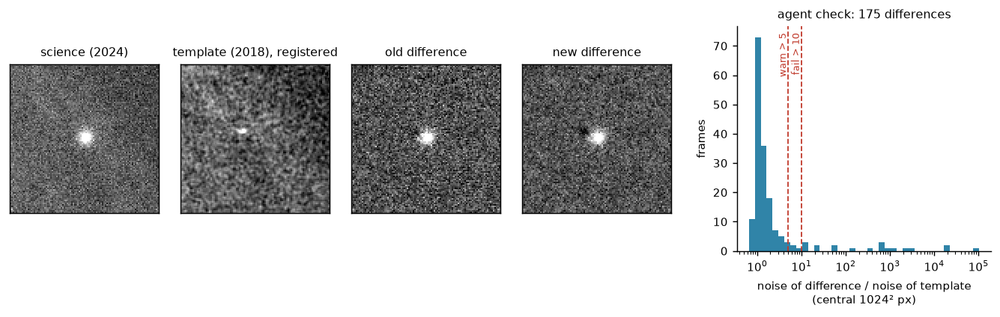

*Left: old vs new. Right: what the agent checks on every frame (dashed red = gate).*

**How the agent checks it**

| check | limit | if it fails |
|---|---|---|
| noise of difference / noise of template | ≤ 10 (warn > 5) | fail: the flux-scale fit went wrong (seen: 20×) |
| masked fraction | ≤ 50 % | warn |

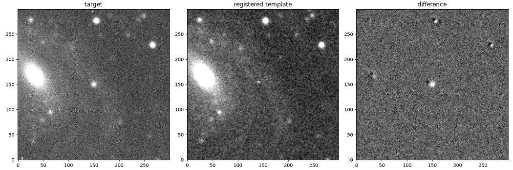

*Review packet: target, registered template and difference. Field stars leave small dipoles, a ~0.6 px registration offset (next improvement).*

## Calibrated magnitudes

Apply zero points and colour terms to get the final magnitude.

| | |
|---|---|
| **old** | calibratemag |
| **new** | ported |

> SN calibrated mag on differences +0.002 ± 0.031 mag (n=92)

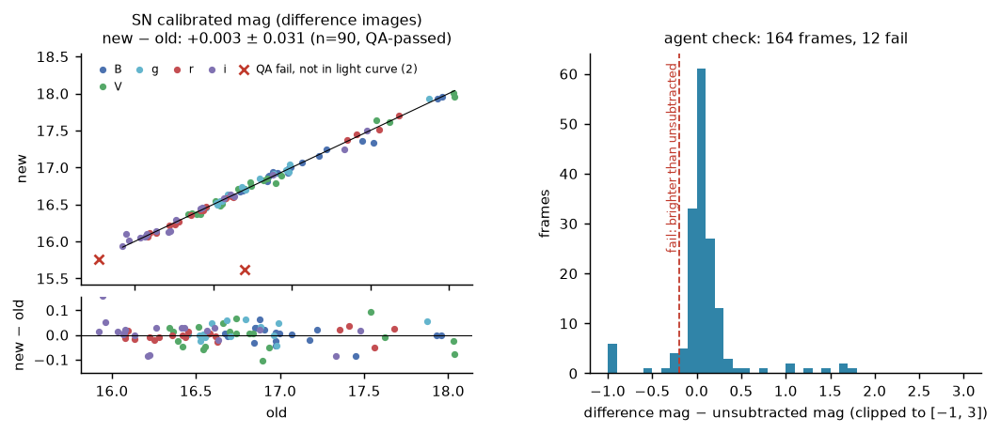

*Left: old vs new. Right: what the agent checks on every frame (dashed red = gate).*

**How the agent checks it**

| check | limit | if it fails |
|---|---|---|
| difference mag − unsubtracted mag | ≥ −0.2 mag | fail: the SN cannot be brighter after removing the galaxy |

## Light curve

Collect all points into the light curve.

| | |
|---|---|
| **old** | getmag; a person looks at the plot (`--show`) |
| **new** | getmag + automatic outlier flags; CSV + ECSV with frame names |

> 152 points; 5 flagged for review

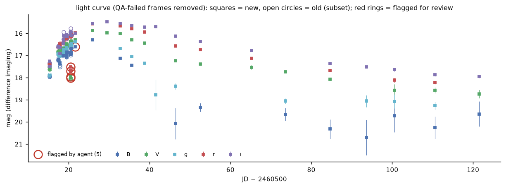

*Left: old vs new. Right: what the agent checks on every frame (dashed red = gate).*

**How the agent checks it**

| check | limit | if it fails |
|---|---|---|
| deviation from running median (±1.5 d, same band) | ≤ max(5σ, 5×error, 0.1 mag) | flagged, kept in the table for review |
